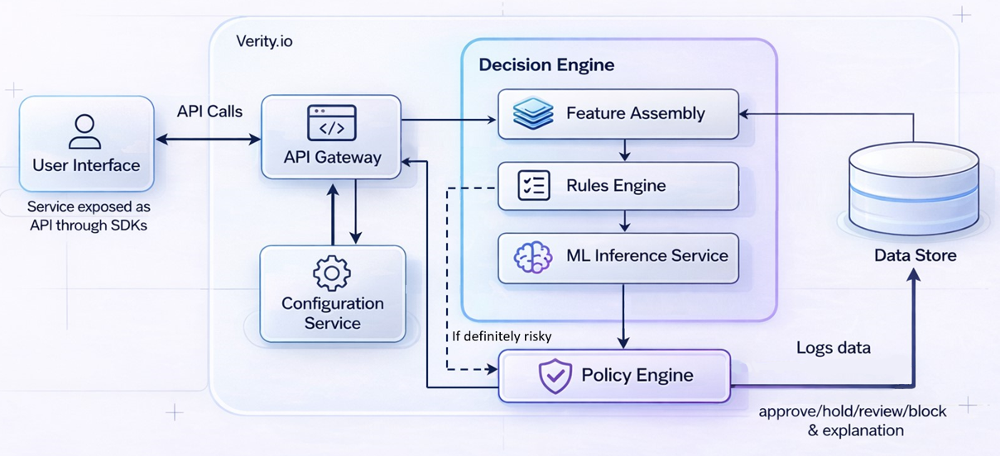

# Verity.io Backend API

FastAPI fraud-decision service used by the frontend transfer flow. This service exposes a stable API contract while internal scoring logic can evolve.

## What This Service Does

- Receives transaction and context signals (user, recipient, device, journey)
- Returns a normalized fraud decision payload for the client app
- Provides health, metadata, and lightweight observability endpoints

## Architecture



The backend follows a contract-first decision pipeline:

- **API Layer** (`app/api/routes.py`) validates requests and exposes stable endpoints under `/api`.
- **Decision Orchestrator** (`app/services/decision_service.py`) coordinates feature assembly, scoring, policy mapping, and review priority.
- **Feature Layer** (`app/services/feature_assembler.py`) derives deterministic risk features from user, recipient, device, transaction, and journey context.
- **Scoring Layer** (`app/ml/scoring_engine.py`, `app/ml/model_adapter.py`) produces `risk_score` through rules-first logic today, with a swap-ready adapter for future ONNX or remote model serving.
- **Policy/Explanation Layer** (`app/services/policy_engine.py`) converts score + rule flags into business-safe actions (`approve`, `hold`, `review`, `block`) plus reason codes and plain-language explanation.
- **Operations Layer** (`app/services/review_service.py`) assigns `review_priority` for follow-up workflows.
- **Observability Layer** (`app/utils/metrics.py`) emits decision counters, fallback counts, and latency metrics.

### Design Principles

- **Stable external contract**: frontend integration should not break when scoring internals evolve.
- **Explainability by design**: reason codes and explanation are first-class outputs, not afterthoughts.
- **Fail-safe behavior**: if advanced scoring is unavailable, service degrades to deterministic rules and still returns a valid decision payload.

## Run Locally (Windows PowerShell)

```powershell
cd backend
py -m venv .venv
.\.venv\Scripts\Activate.ps1
python -m pip install --upgrade pip
pip install -r requirements.txt
uvicorn app.main:app --reload --host 127.0.0.1 --port 8000
```

Docs:
- Swagger UI: `http://127.0.0.1:8000/docs`
- ReDoc: `http://127.0.0.1:8000/redoc`
- OpenAPI JSON: `http://127.0.0.1:8000/openapi.json`

## API Endpoints

All primary endpoints are under `/api`.

- `POST /api/decision` — main risk decision endpoint
- `POST /api/risk-evaluate` — compatibility alias for the same logic
- `GET /api/metadata` — service contract and engine metadata
- `GET /api/live` — liveness probe
- `GET /api/ready` — readiness probe
- `GET /api/metrics` — Prometheus-style counters
- `GET /api/docs-info` — docs URL pointers

## Decision Contract

### Request Body (`RiskDecisionRequest`)

Required top-level fields:
- `transaction_id`
- `user`
- `recipient`
- `device`
- `transaction`
- `journey`

Example request:

```json
{
	"transaction_id": "tx_20260320_001",
	"user": {
		"user_id": "user_aina_001",
		"account_age_days": 420,
		"recent_tx_count": 14
	},
	"recipient": {
		"payee_id": "payee_maju_jaya",
		"payee_name": "MAJU JAYA ENTERPRISE",
		"is_new_payee": true,
		"previous_transfer_count": 0
	},
	"device": {
		"device_id": "device_android_42",
		"is_new_device": true,
		"session_anomaly_count": 1
	},
	"transaction": {
		"tx_type": "duitnow_transfer",
		"amount": 680.0,
		"currency": "MYR",
		"timestamp": "2026-03-20T04:12:00Z"
	},
	"journey": {
		"payee_added_this_session": true,
		"otp_retry_count": 0,
		"recent_support_contact": false
	}
}
```

### Response Body (`RiskDecisionResponse`)

Returned fields:
- `risk_score` (`0.0` to `1.0`)
- `action` (`approve`, `hold`, `review`, `block`)
- `reason_codes` (array of machine-readable reason strings)
- `explanation` (human-readable summary)
- `review_priority` (`none`, `low`, `medium`, `high`)
- `model_version`

Example response:

```json
{
	"risk_score": 0.86,
	"action": "hold",
	"reason_codes": [
		"NEW_PAYEE",
		"NEW_DEVICE",
		"HIGH_AMOUNT"
	],
	"explanation": "Risk pattern detected: first-time recipient, unrecognized device, and higher-than-usual amount.",
	"review_priority": "high",
	"model_version": "v1.0"
}
```

## Health & Metadata

- `GET /api/live` returns process liveness (`alive`)
- `GET /api/ready` returns readiness state (`ready` or `degraded`)
- `GET /api/metadata` returns active engine mode and stable request/response contract fields

## Testing

```powershell
cd backend
.\.venv\Scripts\Activate.ps1
pytest -q
```

## Troubleshooting

- If startup fails, confirm venv activation and dependencies installed from `requirements.txt`
- If port `8000` is occupied, run on another port:

```powershell
uvicorn app.main:app --reload --host 127.0.0.1 --port 8001
```
